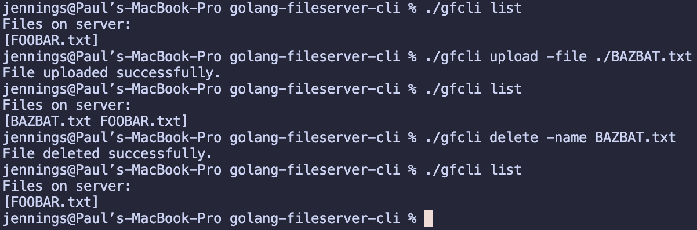

# golang-fileserver-cli
Super simple CLI for [a simple golang fileserver](https://github.com/jtreutel/golang-fileserver).  Supports the following operations

### Usage Guide

List files: `gfcli list`  
Upload a file: `./gfcli upload -file $PATH_TO_FILE`  
Delete a file: `./gfcli delete -name $PATH_TO_FILE`  

### Local Testing

**Setup**
1. Spin up an instance of the fileserver using the instructions [here](https://github.com/jtreutel/golang-fileserver).
2. Build the CLI: `go build -o gfcli ./cmd/cli`
3. Run the CLI (see command docs below): `./gfcli`

### Assumptions

Currently, the CLI assumes that you have an instance of the fileserver running at `127.0.0.1:8080`.

### Screenshot of local testing

